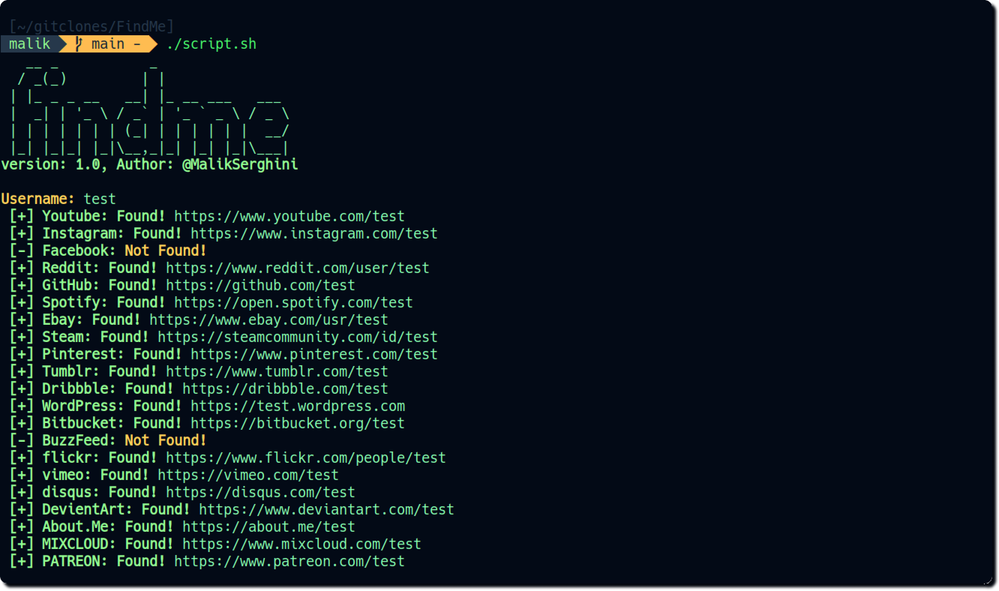

# Social Media Username Checker

This script checks the availability of a given username across various social media platforms and writes the results to a text file.

## Prerequisites

- Ensure that `curl` is installed on your system.

## Usage

1. Clone or download the script to your local machine.
2. Open a terminal and navigate to the directory containing the script.
3. Make the script executable by running:
    ```bash
    chmod +x script.sh
    ```
4. Run the script:
    ```bash
    ./script.sh
    ```
5. Enter the username you want to check when prompted.

## Supported Platforms

The script currently checks for the availability of the username on the following platforms:

- YOUTUBE
- INSTAGRAM
- REDDIT
- GITHUB
- Spotify
- Ebay
- STEAM
- PINTEREST
- TUMBLR
- Dribbble
- WORDPRESS
- BitBucket
- BuZZFEED
- FLICKR
- VIMEO
- DISQUS
- DEVIANART
- ABOUT.ME
- MIXCLOUD
- PATREON

## Example

